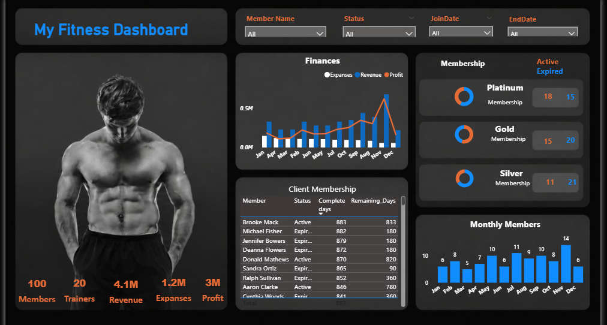

### My Fitness Dashboard 🏋️‍♂️📊

### 📌 Project Overview

Purpose: A dynamic, dark-themed Power BI dashboard engineered to manage, track, and optimize gym business operations.

Scope: Consolidates gym data across finances, trainer resources, and membership statuses into a single interactive layout.

Target Audience: Gym owners, operations managers, and stakeholders looking for data-driven insights into business growth and member retention.

### 📊 Dashboard Preview

### 🎯 Key Objectives

Streamline Operations: Provide a centralized view of operations to quickly identify member trends and financial leaks.

Enhance Retention: Monitor contract expirations to proactively target members nearing the end of their cycles.

Track Financial Health: Evaluate seasonal variations in profit margins to better allocate future marketing budgets.

### 📈 Key Performance Indicators (KPIs)

Total Members: 100 registered clients currently managed in the system.

Total Trainers: 20 staff members managing training programs.

Gross Revenue: 4.1M generated through various member subscriptions.

Total Expenses: 1.2M utilized for operational, facility, and staffing costs.

Net Profit: A strong 3M bottom line, reflecting efficient operational margins.

### 📌 Dashboard Features

Global Interactive Filters: Slicers for Member Name, Status, JoinDate, and EndDate that instantly update all visuals.

Tier Segmentation Breakdown: Dedicated monitoring panels for Platinum, Gold, and Silver tiers, separating active accounts from expired ones.

Granular Client Ledger: A complete tracking table showcasing individual contractual periods, total days, and days remaining.

Monthly Intake Analytics: Bar graphs that track the volume of newly registered members on a month-to-month timeline.

### 🛠️ Tools & Technologies Used

Power BI Desktop: The core platform utilized for data modeling, processing, and visual engineering.

DAX (Data Analysis Expressions): Deployed to build complex calculated columns for membership timeframes and custom aggregates.

### 💡 Business Benefits

Data-Driven Retention: Allows management to identify expired or expiring memberships instantly, enabling targeted renewal campaigns to reduce churn.

Optimized Resource Allocation: Monitors the trainer-to-member ratio ($20 \text{ trainers to } 100 \text{ members}$) to ensure staff resources are balanced and efficiently utilized.

Strategic Financial Planning: Clear visibility into monthly revenue and expense trends helps stakeholders forecast cash flow and plan seasonal marketing budgets.

Improved Tier Marketing: Identifies which membership packages (Platinum, Gold, Silver) are underperforming, helping management redesign packages or run promotions for specific tiers.

### 📊 Insights Generated

High-Value Tiers Are Vulnerable: The Silver and Gold tiers currently have more expired memberships than active ones, highlighting a critical renewal issue.

November Growth Spike: Member onboarding reaches its peak in November (14 members), contrasting heavily with lower-performing months like February (6 members).

Q4 Revenue Surge: Financial revenue tracks significantly higher toward the end of the year, peaking sharply in November/December.

### 👨‍💻 Author

Name: Sushant Shilimkar

Connect: Your LinkedIn Profile

Portfolio: Your Portfolio Link